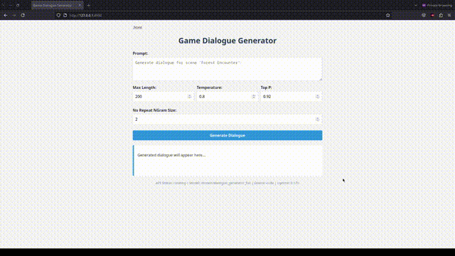

# Game Dialogue Generator

A fine-tuned language model for generating game dialogue in the style of Horizon Dawn.

## Demo



*Demo shows the dialogue generation process with different character and scene inputs*

## What This Project Does

This project uses a fine-tuned GPT-2 model to generate game dialogue for different scenes and characters. It includes:

1. Data processing for game dialogues
2. Model fine-tuning on a dataset of game dialogues
3. A FastAPI web API for serving the model
4. A simple web interface for generating dialogue

## Project Structure

```
HorizonDawn-Dialogue-Generator/
├── api/
│   ├── main.py             # FastAPI application
│   └── dialogue_routes.py  # API routes for dialogue generation
├── data/
│   ├── raw/                # Raw JSON dialogue files
│   ├── processed/          # Processed CSV files
│   └── process_data.py     # Data processing script
├── models/
│   ├── train.py            # Training script
│   ├── dialogue_generator_small/  # Smaller model checkpoint
│   └── dialogue_generator_full/   # Full model checkpoint
├── web/
│   ├── static/             # CSS, JS files
│   └── templates/          # HTML templates
├── requirements.txt        # Project dependencies
└── run.py                  # Script to run the application
```

## How to Run

### Prerequisites

- Python 3.8+
- PyTorch
- Transformers
- FastAPI
- Uvicorn

### Installation

1. Clone the repository:
   ```bash
   git clone https://github.com/yourusername/HorizonDawn-Dialogue-Generator.git
   cd HorizonDawn-Dialogue-Generator
   ```

2. Create and activate a virtual environment:
   ```bash
   python -m venv venv
   source venv/bin/activate  # On Windows use `venv\Scripts\activate`
   ```

3. Install the required packages:
   ```bash
   pip install -r requirements.txt
   ```

### Processing Data
1. Place your JSON dialogue files in the `data/raw/` directory
2. Run the processing script:
   ```bash
   cd data
   python process_data.py
   ```
   This will create structured CSV files in `data/processed/`

### Training Models

1. Train the full model:
   ```bash
   cd models
   python train.py
   ```

### Running the Web API and Interface

1. Start the FastAPI server:
   ```bash
   python run.py
   ```
   
   Or run it directly with uvicorn:
   ```bash
   uvicorn api.main:app --reload
   ```

2. Access the web interface by opening your browser and navigating to:
   ```
   http://localhost:8000
   ```

3. Access the API documentation at:
   ```
   http://localhost:8000/docs
   ```

### Using the API Directly

You can make POST requests to the API endpoint:

```bash
curl -X POST "http://localhost:8000/api/generate_dialogue" \
     -H "Content-Type: application/json" \
     -d '{"scene":"Forest Encounter", "character":"Aloy", "length":200}'
```

### Generating Content
1. Create a testing script (example):
   ```python
   import torch
   from transformers import AutoModelForCausalLM, AutoTokenizer

   def generate_dialogue(scene_name, model_path="models/dialogue_generator_full"):
       # Load model and tokenizer
       tokenizer = AutoTokenizer.from_pretrained(model_path)
       model = AutoModelForCausalLM.from_pretrained(model_path)
       
       # Create prompt
       prompt = f"Generate dialogue for scene '{scene_name}':"
       
       # Generate text
       inputs = tokenizer(prompt, return_tensors="pt")
       outputs = model.generate(
           **inputs, 
           max_length=200,
           temperature=0.8,
           do_sample=True,
           top_p=0.92,
           no_repeat_ngram_size=2
       )
       
       # Decode and print
       result = tokenizer.decode(outputs[0], skip_special_tokens=True)
       return result

   # Example usage
   dialogue = generate_dialogue("Forest Encounter")
   print(dialogue)
   ```

## Model Capabilities

### Small Model
- Base: GPT-2 (124M parameters)
- Training: 2 epochs on 20 examples
- Use case: Quick testing and development

### Full Model
- Base: GPT-2 (124M parameters) 
- Training: 5 epochs on 100 examples
- Use case: Production-ready dialogue generation

## Sample Outputs
- **Input**: "Generate dialogue for scene 'Forest Encounter':"
- **Output**: *[Model-generated dialogue based on the scene prompt]*

## Technical Details
- The model is trained using causal language modeling
- Data processing handles multiple JSON formats for flexibility
- Compatible with Apple Silicon's MPS acceleration
- Handles dialogue formatting with proper speaker attribution

## Future Improvements
- Implement web interface for easy dialogue generation
- Add support for larger models (GPT-2 Medium/Large)
- Expand training dataset with more diverse dialogue examples

## License
This project is licensed under the MIT License. See the LICENSE file for more details.